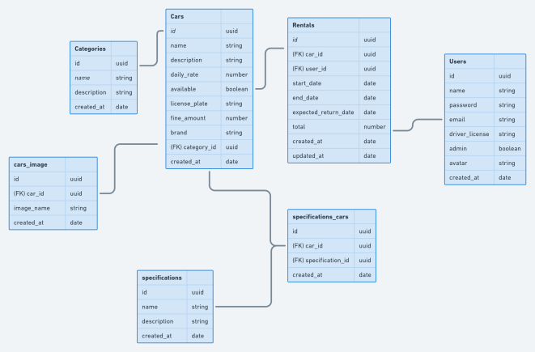

# rentalx-ignite

# Diagrama

# Cadastro de carro

**Requisitos Funcionais**
RF001 - Deve ser possível cadastrar um carro

RF002 - Deve ser possível listar todas as categorias

**Regras de Negócio**

RN001 - Não deve ser possível cadastrar um carro com placa existente

RN002 - Não deve ser possível alterar a placa de um carro já cadastrado

RN003 - O carro deve ser cadastrado com disponibilidade por padrão

RN004 - O usuário responsável pelo cadastro deve ser um usuário administrador 

# Listagem de carros

**Requisitos Funcionais**

RF001 - Deve ser possível listar os carros disponíveis

RF002 - Deve ser possível listar todos os carros disponíveis por categoria

RF003 - Deve ser possível listar todos os carros disponíveis por marca

RF004 - Deve ser possível listar todos os carros disponíveis por nome

**Regras de Negócio**

RN001 - O usuário não presica estar logado no sistema

# Cadastro de especificação no carro

**Requisitos Funcionais**

RF001 - Deve ser possível cadastrar uma especificação para um carro

**Regras de Negócio**

RN001 - Não deve ser possível cadastrar uma especificação para um carro não cadastrado

RN002 - Deve ser possível listar todas as especificações

RN003 - Deve ser possível listar todos os carros

RN004 - Não deve ser possível cadastrar uma especificação já existente para um mesmo carro

RN005 - O usuário não presica estar logado no sistema

# Cadastro de imagens do carro

**Requisitos funcionais**
RN001 - Deve ser possível cadastrar a imagem do carro deve ser possível listar todos os carros

**Requisitos não funcionais** 

RNF001 - Utilizar o multer para upload dos arquivos Regras de negócio

RNF002 - O usuário pode cadastrar mais de uma imagem para o mesmo carro 

RNF003 - O usuário responsável pelo cadastro deve ser um administrador

# Alugar o carro

**Requisitos funcionais** 

RN001 - Deve ser possível cadastrar um aluguel

**Requisitos não funcionais** 
RNF001 - Utilizar o multer para upload dos arquivos Regras de negócio

RNF002 - O aluguel deve ter duração mínima de 24 hora

RNF003 - Não deve ser possível cadastrar um novo aluguel caso já exista um aberto para o mesmo usuário 

RNF004 - Não deve ser possível cadastrar um novo aluguel caso já exista um aberto para o mesmo carro.

